### 엣지AI

#### 클라우드 AI (Cloud AI)

중앙 서버(클라우드)에서 AI 모델을 실행하고 결과를 반환하는 방식
- AI 모델이 클라우드 서버에서 실행됨
- 인터넷 연결이 필수적
- 서버의 강력한 연산 자원을 활용해 복잡한 연산과 대규모 데이터 처리 가능
- 사용자는 클라이언트(스마트폰, IoT 기기 등)에서 데이터를 전송하고 결과를 받아옴

장점
- 실시간 응답 가능 (지연 시간 최소화)
- 인터넷 연결 없이도 일부 기능 수행 가능
- 데이터 프라이버시 강화 (클라우드에 모든 데이터를 전송할 필요 없음)

단점

- 인터넷 연결 없으면 사용 불가능
- 데이터 전송 지연(latency)이 발생할 수 있음
- 보안 문제(개인 데이터가 서버로 전송됨)

#### 엣지 AI (Edge AI)
클라우드가 아니라 네트워크 엣지(근처의 서버 or 장치)에서 AI 모델을 실행하는 방식

- 데이터 처리가 엣지 디바이스(로컬 서버, 게이트웨이, IoT 장비 등)에서 수행
- 클라우드보다 빠른 응답 속도 제공 (네트워크 지연이 적음)
- 클라우드와 연동 가능하지만, 일부 데이터는 로컬에서 처리

장점

- 실시간 응답 가능 (지연 시간 최소화)
- 인터넷 연결 없이도 일부 기능 수행 가능
- 데이터 프라이버시 강화 (클라우드에 모든 데이터를 전송할 필요 없음)

단점

- 클라우드보다 연산 자원이 제한적
- 모델 업데이트가 어려울 수 있음

예시
- 자율주행차 (차량 내 AI 프로세서로 실시간 분석)
- 스마트 공장 (로컬 서버에서 AI 분석 후 즉시 기계 제어)
- 보안 카메라 (로컬에서 얼굴 인식 후 클라우드로 일부 데이터 전송)

#### 온디바이스 AI (On-Device AI)

AI 모델을 기기 자체에서 실행하는 방식

특징
- AI 모델이 스마트폰, 스마트워치, 자동차, IoT 기기 자체에서 실행
- 인터넷 연결 없이 완전 독립적으로 동작
- 최신 모바일 칩셋(AP, NPU)이 AI 연산을 지원하는 경우 증가

장점

- 완전한 실시간 처리 가능 (지연시간 거의 없음)
- 완벽한 오프라인 동작 (인터넷 없이 AI 기능 사용 가능)
- 개인정보 보호 강화 (데이터가 기기에서 벗어나지 않음)

단점

- 기기 성능에 따라 AI 기능이 제한적일 수 있음
- 대형 모델 실행이 어려움 (압축된 모델 필요)

🔹 예시
- 스마트폰의 얼굴 인식 / 음성 비서 (Google Tensor, Apple Neural Engine)
- 삼성 갤럭시의 온디바이스 번역 (삼성 AI 번역기)

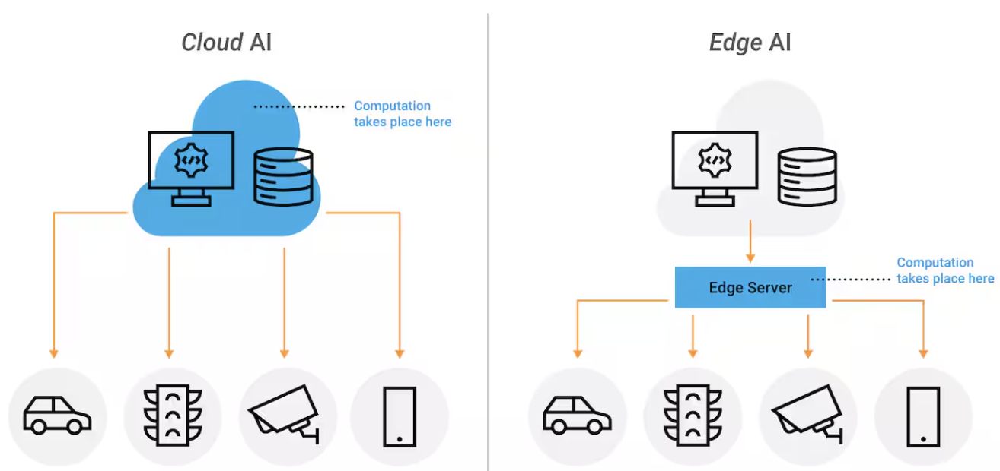
*[출처]https://www.akamai.com/glossary/what-is-ai-on-edge-networks*
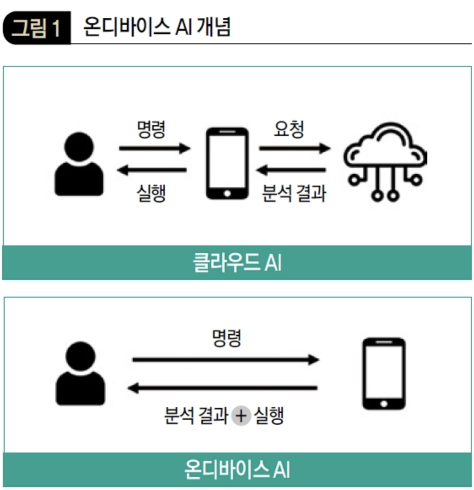
*[출처]https://dbr.donga.com/article/view/1203/article_no/9635*

### Tiny AI

Tiny AI는 경량화된 AI 모델을 활용하여 저사양 기기에서도 실행할 수 있도록 최적화된 AI 기술을 의미합니다.
즉, AI 모델을 작고 가볍게 만들어서 스마트폰, IoT 기기, 센서, 웨어러블 등에서 동작할 수 있도록 설계된 AI입니다.

1. 모델 크기 축소 (경량화)
2. 저전력 소비 (효율적인 연산)
3. 온디바이스 실행 (Edge AI & On-Device AI)

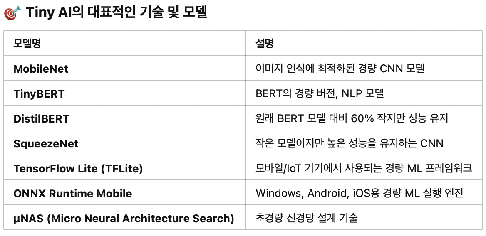

### 모바일에서의 AI

#### Android의 AI

Gemini Nano
- 온디바이스 생성형 AI 모델, 지연 시간 단축, 비용 절감, 개인 정보 보호
- Gemini Nano API 및 AICore에 대한 액세스는 Google AI Edge SDK에서 제공

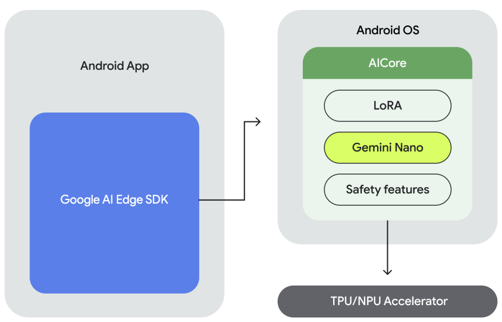
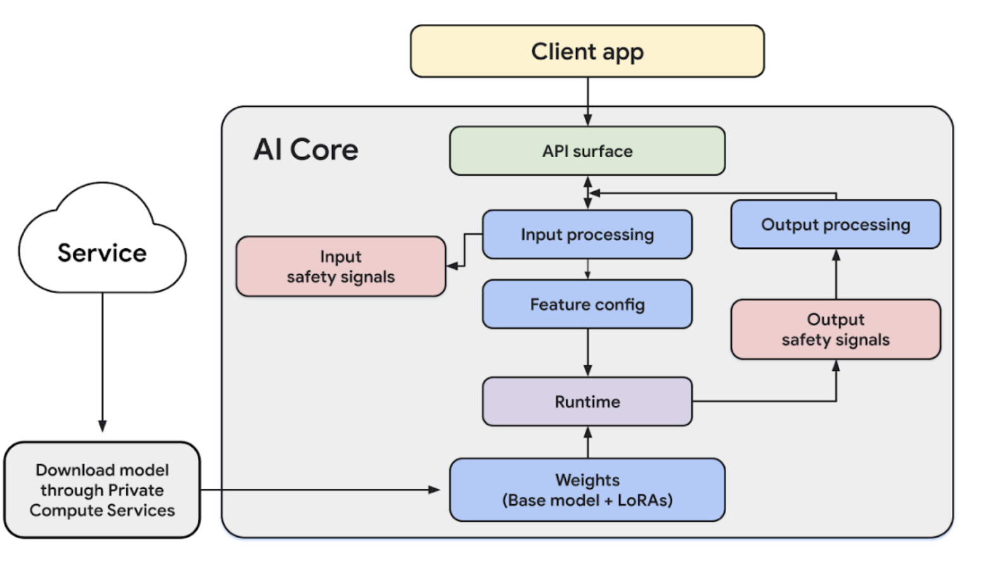

Firebase용 Vertex AI
- Gemini API 및 Gemini 모델군에 직접 액세스
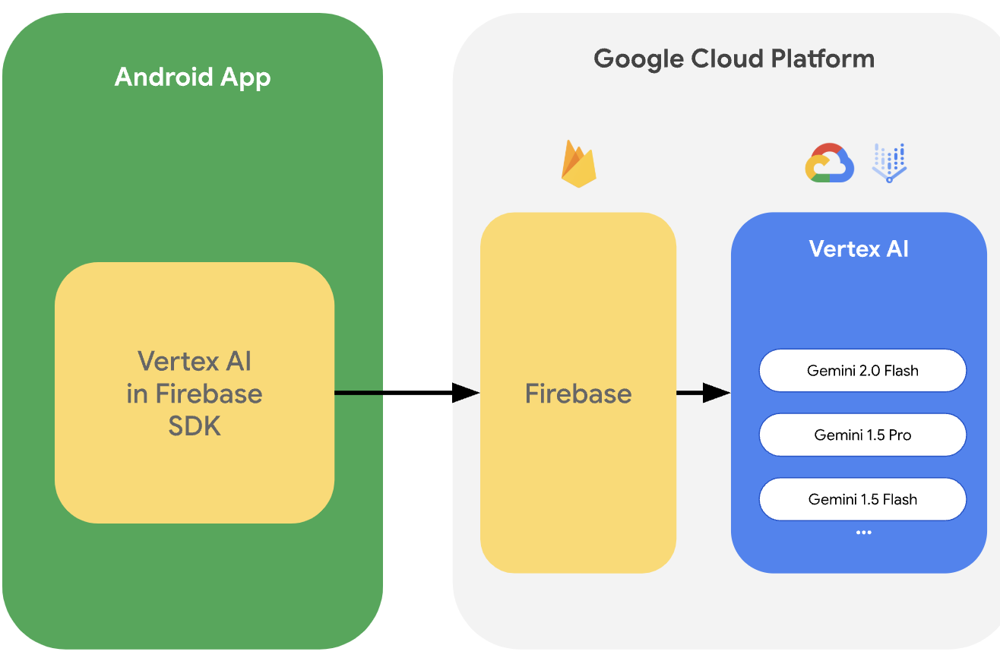

ML Kit
- Google의 온디바이스 머신러닝 기술을 Android 및 iOS 앱에 결합한 모바일 SDK
- Vision API
- Natural Language API
- 텍스트 인식, 얼굴 인식, 바코드 스캔, 이미지 라벨 지정, 객체 감지 및 추적, 포즈 감지, 셀카 자동 분류, 스마트 답장, 텍스트 번역, 언어 식별
- ML Kit의 API는 Google의 학습 모델을 사용합니다. 이러한 모델은 다양한 응용 분야에서 사용할 수 있도록 설계되었습니다. 그러나 일부 사용 사례에는 보다 타겟팅된 모델이 필요합니다. 그렇기 때문에 이제 일부 ML Kit API에서 기본 모델을 맞춤 TensorFlow Lite 모델로 바꿀 수 있습니다.
- 선행 학습된 TensorFlow Lite 모델이 일련의 기준(TensorFlow Lite 모델 호환성)을 충족하는 경우 사용할 수 있습니다

LiteRT
- essentials for deploying high performance, custom ML features into your Android app.
          
#### iOS의 AI

Core ML

- Core ML은 앱에 머신 러닝 및 AI 모델을 손쉽게 통합하는 편의성에 더불어 Apple 기기에서 놀랄 만큼 빠른 성능을 선보입니다. Core ML 도구를 사용하여 다른 학습 라이브러리의 모델을 변환하거나 즉시 사용 가능한 Core ML 모델을 다운로드해 보세요. Xcode에서 모델을 미리 보고 모델의 성능을 바로 확인할 수도 있습니다.
- Core ML은 Apple Silicon을 활용하고 메모리 공간 및 전력 소모를 최소화하여 다양한 모델 유형의 온디바이스 성능에 최적화되어 있습니다.
- 단 몇 줄의 코드를 사용하여 이미지 및 비디오의 물체 인식, 언어 분석, 사운드 분류 등의 스마트한 온디바이스 머신 러닝 기반 기능을 앱으로 가져올 수 있습니다.
- Core ML 모델은 엄격하게 사용자의 기기에서만 실행되고 네트워크에 연결할 필요가 없으므로 앱의 반응을 보장하면서 사용자 데이터를 비공개로 유지할 수 있습니다.
- TensorFlow 또는 PyTorch와 같은 라이브러리의 모델을 Core ML 도구를 사용하여 그 어느 때보다 쉽게 Core ML로 변환할 수 있습니다.
- Core ML은 고급 모델 압축 지원, 스테이트풀 모델 및 효과적인 트랜스포머 모델 구동 실행 등을 통해 생성형 AI 모델을 지원합니다.
- CoreML 모델 https://developer.apple.com/kr/machine-learning/models/

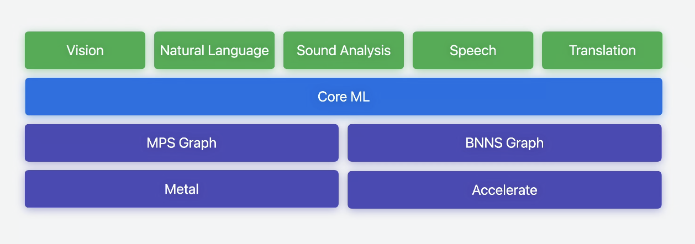
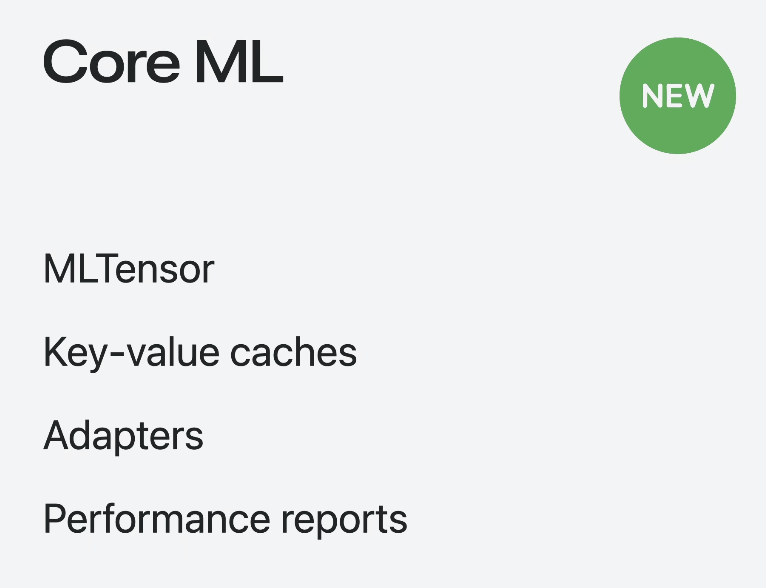

Core ML Tools
- Convert models from TensorFlow, PyTorch, and other libraries to Core ML.
- https://apple.github.io/coremltools/docs-guides/

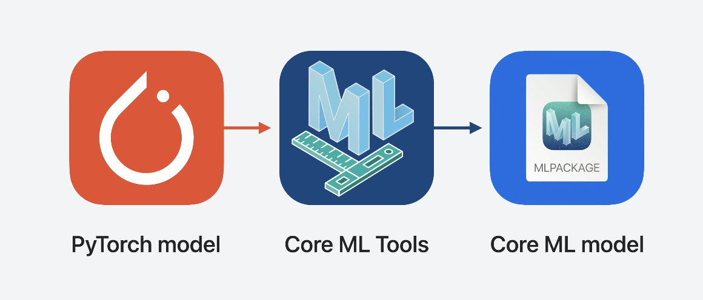
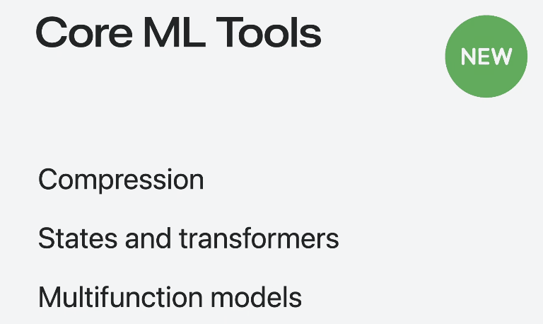

머신 러닝 기반 API
- 머신 러닝 사용 경험이 없어도 즉각적인 앱 통합을 위해 설계된 머신 러닝 기능을 활용할 수 있습니다.
- Vision
Natural Language
Speech
Sound Analysis
Translation

Create ML
- Create ML 앱을 사용하면 코드 작성 없이 Mac에서 바로 Core ML 모델을 빠르게 빌드하고 학습시킬 수 있습니다. 사용하기 쉬운 앱 인터페이스, 내장된 시스템을 맞춤화하는 기능 등의 장점을 활용하면 학습 데이터만 준비하여 모델 빌드 및 학습 과정을 그 어느 때보다도 간편하게 시작할 수 있습니다. 스냅샷 및 미리보기와 같은 기능으로 모델 학습 및 정확성을 시각화하고 학습 과정을 관리해 보세요. Create ML과 Create ML Components 프레임워크를 사용하면 깊이 있는 분석, 효과적인 관리, 앱 내 모델 생성이 가능합니다.
- Create ML에는 선택 가능한 다양한 모델 유형이 탑재되어 있습니다. 앱에서 모델 유형을 선택하고 데이터와 매개변수를 추가하기만 하면 학습을 시작할 수 있습니다.
- 참고 https://ios-daniel-yang.tistory.com/entry/iOSSwift-CoreML-Create-ML%EC%9C%BC%EB%A1%9C-Model-%EB%A7%8C%EB%93%A4%EA%B8%B0

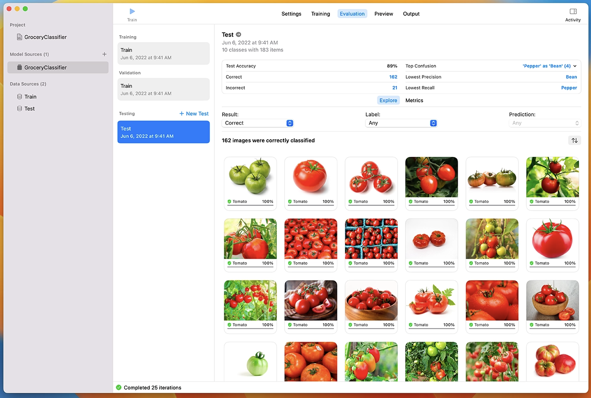

TensorFlow용 Metal 플러그인
- TensorFlow Metal 플러그인은 간소화된 설치 프로세스, 그래프 옵티마이저, 16비트 플로트를 사용한 혼합형 정밀 지원 및 새롭게 도입된 16비트 브레인 플로트 데이터 유형이 포함된 1.0 릴리즈가 출시되었습니다.

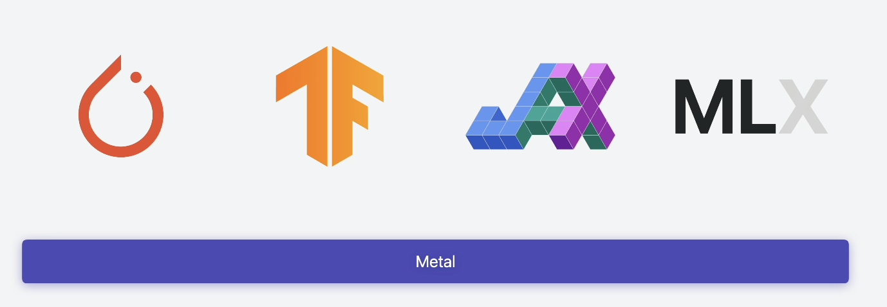

Mac에서의 PyTorch 학습
- 광범위한 오퍼레이터 및 네트워크 적용 범위, 향상된 테스트 및 성능 최적화가 포함된 MPS 백엔드의 베타 릴리즈가 출시되었습니다. 프로파일링, 맞춤형 커널 및 혼합 정밀도와 같은 새로운 기능을 통해 더 많은 ML 모델을 향상시키고 최적화할 수 있습니다.

#### 파이토치에서 변환
https://pytorch.org/mobile/home/